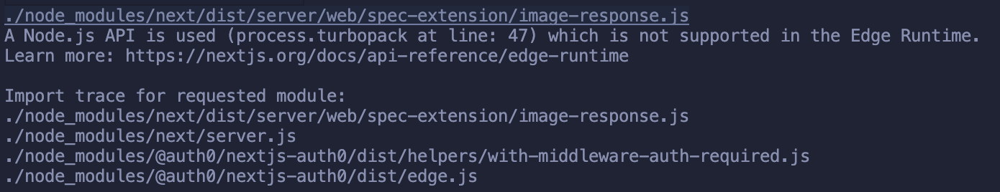

This is a [Next.js](https://nextjs.org/) project bootstrapped with [`create-next-app`](https://github.com/vercel/next.js/tree/canary/packages/create-next-app).

## Steps to reproduce error

The error seems to be intermittent. If you don't see it on the first builds, keep deleting the `.next` folder and re-build. I get it pretty consistently, but sometimes it won't throw the warning.

```sh
# Make sure you are on latest Yarn version (>2.0.0).
yarn set version stable

# Install dependencies specified in package.json
yarn install

# Build the application
yarn build

# Build Docker container
yarn docker:build
```

# Error Output


